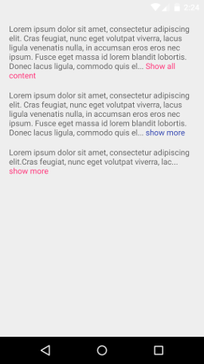
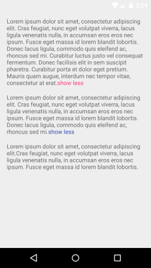

# ReadMoreTextView

A Custom TextView with trim text

## Download
To add the ReadMoreTextView library to your Android Studio project, simply add the following gradle dependency:
```java
compile 'com.borjabravo:readmoretextview:2.1.0'
```

## Usage

To use the ReadMoreTextView on your app, add the following code to your layout:

```xml
<com.ntduc.readmoretextview.ReadMoreTextView
    android:id="@+id/text_view"
    android:layout_width="match_parent"
    android:layout_height="wrap_content"/>
```    

You can customize ReadMoreTextView with:

- app:trimExpandedText: Text that appears when the view is expanded.
- app:trimCollapsedText: Text that appears when the view is collapsed.
- app:trimLength: Trim length to determine when the clickable text is displayed.
- app:showTrimExpandedText: Show the trim text if it's true. 
- app:colorClickableText: Text color of trim clickable text.
- app:trimMode: Choose trim mode with two options: trimModeLength or trimModeLines.

## Screenshots



